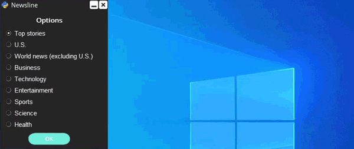
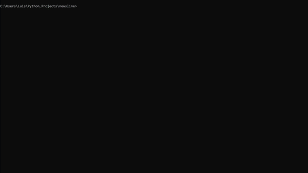
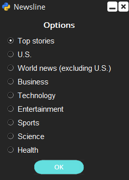
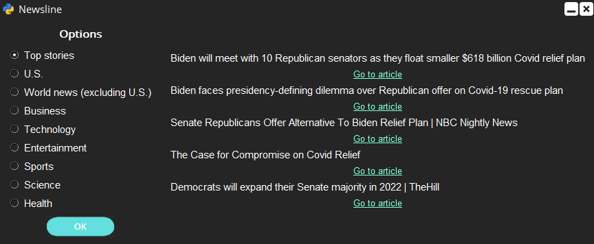
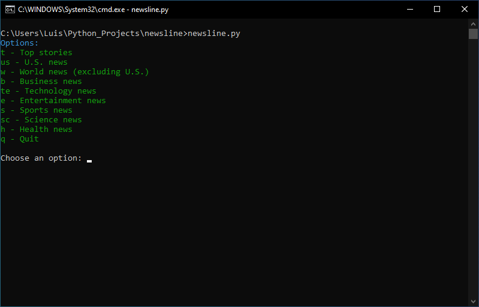
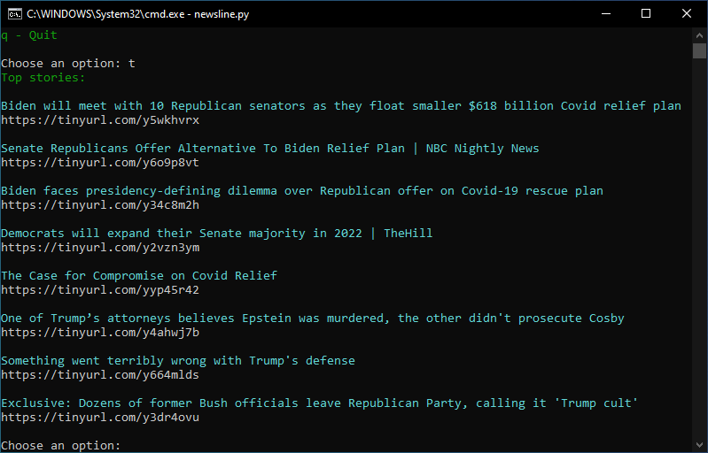

# Newsline

GUI and CLI program for scraping news from Google News.

# Installation

Open your terminal and type:

    $ git clone https://github.com/lviloriabas/newsline.git

# GUI

Select one of the nine options:

* Top stories
* U.S.
* World news (excluding U.S.)
* Business
* Technology
* Entertainment
* Sports
* Science
* Health

Your news will appear at the right side of the options panel.

# CLI

Select one of the ten options:
Option|Key
---|:---:
Top stories| t
U.S. news| us
World news (excluding U.S.)| world
Business news| b
Technology news| te
Entertainment news| e
Sports news| s
Science news| sc
Health news| h
Quit| q

After you choose an option the program will start to print news articles to the terminal.

